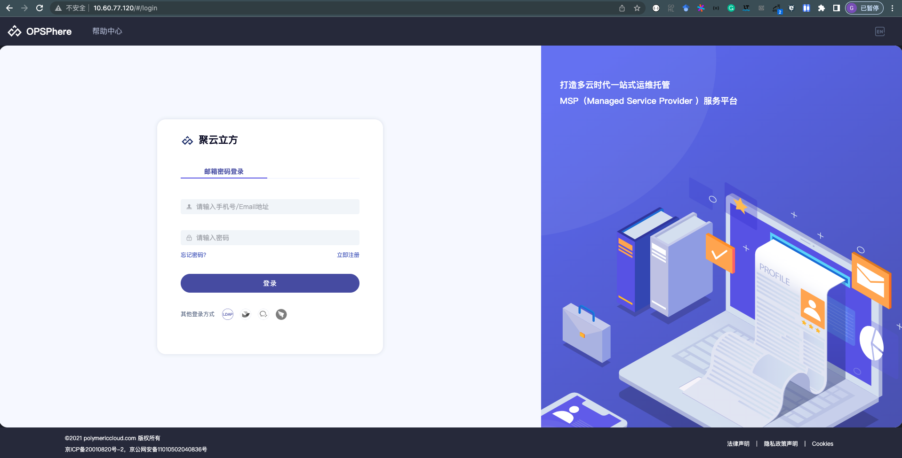

# micro-quickstart

## 部署环境
单实例部署需要一台物理机或者一台 4C

## 一键部署
```
# sh install.sh
```
启动成功之后，会在终端看到 'Start Opsphere Successfully' 日志，默认前端监听的端口号为 80， 可以通过IP:PORT的方式访问云管平台控制台。


## 开发调试
### 删除服务

1. 删除服务

必须在服务为停止状态后，才可以删除该服务，比如删除 jcloud-nginx-svc 服务：
```shell
# docker-compose stop jcloud-nginx-svc
# docker-compose rm jcloud-nginx-svc
```

2. 全部服务启动/删除
```shell
# docker-compose up -d
# docker-compose down
```
  
#### 更新服务  
修改docker-compose 文件，找到对应的服务名称，修改该服务中的 image 信息，比如：
```yml
jcloud-front-svc:
    container_name: jcloud-front
    image: my-registry.tencentcloudcr.com/jcloud/jcloud-front:release-test-jcloud.front-v2.0.1.202207291838
    expose:
      - '80'
    networks:
      - opsphere-network
```

更新完镜像之后，重新启动一下该服务

```shell
# docker-compose up jcloud-front-svc -d
# docker ps |grep jcloud-front-svc    # 查看镜像是否已更新
```

